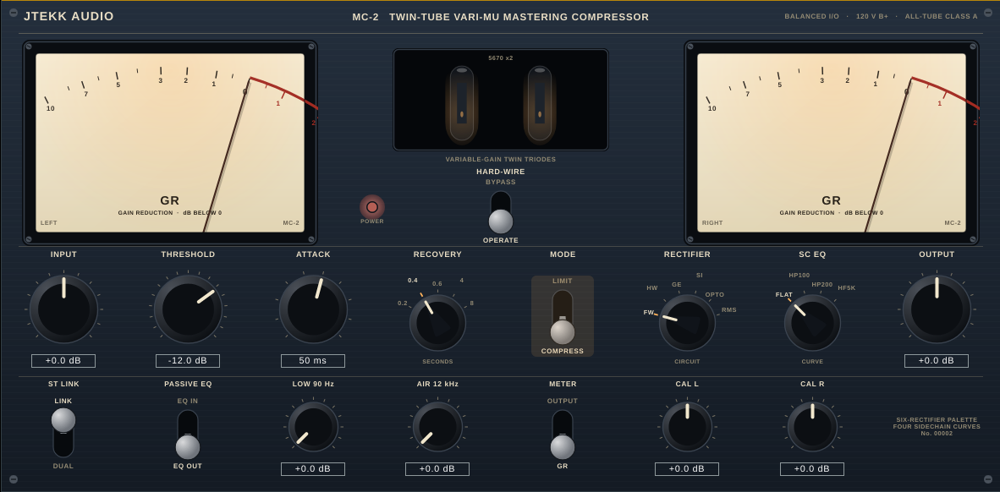

# MC-2 — Twin-Tube Vari-Mu Mastering Compressor

[](https://github.com/Jtekkk/Mastering-Compressor-2/actions/workflows/ci.yml)

A mastering-grade variable-mu (variable-gain tube) compressor/limiter plugin in the
classic twin-tube tradition, built with [JUCE](https://juce.com). Ships as **VST3**
(plus Standalone, and AU when built on macOS).



## Feature map

Every line of the hardware spec sheet and where it lives in the plugin:

| Hardware spec | Implementation |
| --- | --- |
| Balanced inputs and outputs | Input/output line-stage trims (±12 dB, 0.5 dB detents), output iron 5 Hz LF behaviour, flat balanced response |
| Variable-gain vacuum tube per channel: 5670 | The gain element *is* the modelled 5670 stage: the control voltage re-biases the triode, and 2nd-harmonic content blooms with gain reduction (`Source/DSP/TubeStage.h`) |
| Hard-wire bypass switch | `HARD-WIRE` paddle (also exposed as the host bypass parameter); the programme never touches the circuit |
| Recovery, 5 steps | 0.2 s / 0.4 s / 0.6 s / 4 s / 8 s rotary switch |
| Variable attack 25–70 ms | Detented attack knob, 5 ms steps |
| Limit or Compress modes | `MODE` paddle. COMPRESS = gentle 1.5:1, 6 dB knee. LIMIT = feedback ratio that stiffens from 4:1 toward 20:1 as you push into it |
| Stereo link switch | `ST LINK` paddle — sums the two control voltages like the hardware; unlinked, each channel rides its own sidechain |
| Front-panel meter calibration | `CAL L` / `CAL R` trims, ±3 dB in 0.25 dB detents |
| Large illuminated Sifam meters | Two vector-drawn, lamp-lit VU meters with true logarithmic dial geometry and 300 ms ballistics; switchable GR / output, 0 VU = −18 dBFS |
| Twin-tube design | Two cascaded triode stages per channel (input triode + 5670 mu stage), each normalised for unity gain so colour and gain stay independent |
| Six rectifier circuits | `RECTIFIER` switch: Tube FW, Tube HW, Germanium, Silicon, Opto, RMS — each with its own detection law and ballistic scaling (`Source/DSP/Rectifiers.h`) |
| Excellent sonic range, low noise | Whole path runs oversampled - 2× by default, selectable 1×/2×/4×/8× (linear-phase halfbands, latency reported) - double-precision filters, no added noise |
| Sidechain EQ | 4 built-in curves: FLAT, HP 100 Hz, HP 200 Hz + presence, HF lift 5 kHz |
| Sweet passive EQ | Boost-only, broad low-Q shelves: LOW +0…6 dB @ 90 Hz, AIR +0…6 dB @ 12 kHz, with an in/out paddle |
| All controls switches or detented knobs | Every parameter is stepped — settings are exactly repeatable |
| High 120 V operating voltage | +24 dBFS soft rail ceiling: enormous headroom, gentle onset |
| Extremely musical, lively sound | Feedback topology + programme-dependent mu-stage harmonics — the compression curve and the tone are one circuit, as in the hardware |

## Architecture

```
in ──> input trim ──> [ input triode ] ──> [ 5670 mu stage ] ──┬──> passive EQ ──> output trim ──> output iron ──> rails ──> out
                                              ▲                │
                                              │ CV             ▼ (feedback tap)
                                       attack/recovery <── rectifier (×6) <── sidechain EQ (×4)
                                              ▲
                                              └── stereo link (CV sum)
```

* **Feedback detection** — the sidechain listens to the mu-stage *output*. With a
  proportional control law `GR = k · overshoot`, the input-referred ratio is exactly
  `1 + k`, which is how the front-panel ratios are realised (k = 0.5 for 1.5:1;
  k = 3→19 for 4:1→20:1).
* The DSP core (`Source/DSP/`) is dependency-free C++17 — it compiles and runs
  without JUCE, which is how the test harness drives it.
* The GUI is 100 % vector-drawn (no image assets): `Source/GUI/`.

## Building

Requires CMake ≥ 3.22 and a C++17 compiler. JUCE 8 is fetched automatically.

```bash
# Linux: install JUCE's usual dev packages first
sudo apt install libasound2-dev libx11-dev libxext-dev libxinerama-dev \
                 libxrandr-dev libxcursor-dev libfreetype-dev libfontconfig1-dev

cmake -B build -DCMAKE_BUILD_TYPE=Release
cmake --build build --target MC2_VST3 -j$(nproc)
```

The VST3 lands in `build/MC2_artefacts/Release/VST3/`. Other targets:
`MC2_Standalone`, and `MC2_AU` on macOS.

### Cross-compiling for Windows (from Linux)

Uses [llvm-mingw](https://github.com/mstorsjo/llvm-mingw) (clang + lld +
current mingw-w64, UCRT). Plain GCC/MinGW cannot build JUCE 8: its Direct2D
code uses `_Pragma` inside default member initializers (GCC rejects this),
and distro mingw-w64 headers predate Direct2D 1.3.

```bash
# one-time toolchain setup: unpack an llvm-mingw ucrt release into /opt/llvm-mingw
curl -fsSL -o /tmp/llvm-mingw.tar.xz \
  https://github.com/mstorsjo/llvm-mingw/releases/download/20260602/llvm-mingw-20260602-ucrt-ubuntu-22.04-x86_64.tar.xz
sudo tar xf /tmp/llvm-mingw.tar.xz -C /opt && sudo mv /opt/llvm-mingw-2*  /opt/llvm-mingw

cmake -B build-win -DCMAKE_BUILD_TYPE=Release \
      -DCMAKE_TOOLCHAIN_FILE=cmake/toolchain-llvm-mingw-w64.cmake
cmake --build build-win --target MC2_VST3 MC2_Standalone -j$(nproc)
```

The VST3 bundle lands in `build-win/MC2_artefacts/Release/VST3/` — copy the
whole `MC-2 Mastering Compressor.vst3` folder to
`C:\Program Files\Common Files\VST3\`. Binaries are self-contained (static
libc++/winpthread; imports only Windows system DLLs and the UCRT).

Supporting pieces, applied automatically:

* `cmake/patch-juce.cmake` — fixes two MSVC-isms in JUCE 8.0.4 that clang
  rejects (a dead `AudioPluginInstance` constructor; `__uuidof` on
  `ComSmartPtr` expressions). Applied via FetchContent `PATCH_COMMAND`,
  also valid for MSVC builds.
* `cmake/mingw-compat.h` — force-included SDK shim (`<cstring>`, the missing
  `CaretPosition` UIA enum) plus a `Dbghelp.h` case-alias in
  `cmake/win-include-aliases/`.
* `cmake/mc2.manifest` (+ `manifest-exe.rc` / `manifest-dll.rc`) — embeds the
  ComCtl32 v6 side-by-side manifest that MSVC gets from JUCE's
  `/manifestdependency` pragma. Without it, Windows binds legacy comctl32
  5.82 and loading fails with "Entry Point Not Found: TaskDialogIndirect"
  (Wine does not enforce SxS versioning, so only real Windows catches this).
* The optional VST3 `moduleinfo.json` manifest step is skipped because the
  helper tool is a Windows executable; hosts do not require it.

The cross-built engine passes the same DSP suite under Wine
(`wine build-win/dsp_smoke.exe`), and the module's `GetPluginFactory`/class
enumeration has been exercised under Wine as well.

### DSP verification

A headless test harness measures the engine against the spec sheet — ratios,
attack/recovery times, all six rectifiers, sidechain curves, link behaviour,
passive EQ and tube harmonics, plus:

* a **frequency response sweep** (20 Hz-20 kHz, EQ out, no GR) checking the
  passive path stays within ±1 dB from 100 Hz-10 kHz;
* a **THD curve** across five input levels (-24…-3 dBFS) showing the tube
  stage's distortion climb as level increases;
* **attack/recovery tables** across all 10 attack and 5 recovery detents,
  each asserted to be monotonically slower than the last; and
* a **stereo image preservation** check — a programme panned 6 dB L-over-R
  keeps that balance within 0.3 dB after linked-stereo compression.

```bash
cmake --build build --target dsp_smoke && ./build/dsp_smoke
```

Sample of what it verifies on this build: COMPRESS measures 1.52:1, LIMIT sits at
9.5:1 mid-drive, attack-to-63 % GR is 24 ms / 60 ms at the 25/70 ms settings, and
the 2nd harmonic rises with gain reduction exactly as a re-biased mu stage should.

## Continuous integration & releases

Every push and pull request runs [`.github/workflows/ci.yml`](.github/workflows/ci.yml),
which calls the reusable [`build.yml`](.github/workflows/build.yml) workflow to
configure, build (VST3 + Standalone everywhere, plus AU on macOS) and run
`dsp_smoke` on native Linux, macOS (universal `arm64`/`x86_64`) and Windows
runners. Each platform's freshly built VST3 (and AU, on macOS) is then run
through [pluginval](https://github.com/Tracktion/pluginval) at strictness
level 5 — parameter automation, state save/reload and background-thread
parameter changes are all exercised against the real binary, not just the
DSP core. A red check means the build, the DSP suite, or host automation
broke on that platform.

The Windows job also builds a proper installer: [`installer/windows/MC2.iss`](installer/windows/MC2.iss)
(Inno Setup, preinstalled on GitHub's Windows runners) packages the VST3
into `Common Files\VST3` and the Standalone app into `Program Files`, with
component selection (VST3-only / Standalone-only / both) and Start
Menu/desktop shortcuts. It's uploaded as the `MC2-Windows-Installer`
artifact on every run - open any CI run's summary page and grab it from
Artifacts, no tag required.

To cut a release:

1. Bump `project(... VERSION x.y.z ...)` in `CMakeLists.txt`.
2. Tag the commit `vx.y.z` and push the tag.

[`release.yml`](.github/workflows/release.yml) verifies the tag matches the
CMakeLists version, runs the same three-platform build, then packages and
attaches a `.zip` per platform plus the Windows `.exe` installer to a new
GitHub Release.

## Beyond the hardware

A few conveniences the original circuit never had:

* **Factory presets** — Vocal Glue, Mix Bus, Drum Bus, Master Gentle and Loud
  Master, in the `PRESETS` dropdown top-left. They're also exposed through
  the standard host program API, so hosts with their own preset browser see
  them too.
* **Undo/redo** — every parameter change goes through a `juce::UndoManager`;
  the `UNDO`/`REDO` pair top-right walks it back and forward. Rapid knob
  drags collapse into one step roughly every half second.
* **LUFS-I / LUFS-S / true-peak metering** (`Source/DSP/Metering.h`) — a
  mixing/mastering reference loudness meter, not a certified compliance
  measurement: K-weighting via RBJ-cookbook filters shaped to the ITU-R
  BS.1770 K-curve, the standard two-stage gated block scheme for integrated
  loudness (400 ms blocks, 100 ms step, -70 LUFS absolute gate, -10 LU
  relative gate), an ungated 3 s window for short-term, and a 4x Catmull-Rom
  true-peak estimate (can register inter-sample overs a plain sample-peak
  reading would miss). Read out top-centre in the plugin header.
* **Oversampling selector (1x/2x/4x/8x)** — top bar, right of the LUFS
  readout. All four factors are preallocated in `prepareToPlay`, so
  switching between them at any time (not just between host prepare calls)
  never allocates on the audio thread; the engine is simply re-prepared at
  `hostRate x factor` and the new latency reported to the host. It's a
  non-automatable, structural setting rather than a musical control - the
  same reasoning as a sample-rate change, not a parameter you'd ride.
* **Mid/Side processing** — the `STEREO`/`M/S` toggle top bar, left of the
  LUFS readout. Encodes L/R to Mid/Side (`mid=(L+R)/2`, `side=(L-R)/2`)
  before the oversampled path and decodes back afterwards (an exact
  inverse pair), so the twin-tube engine's two channels become independent
  Mid and Side circuits instead of Left and Right - compress the centre
  and the width separately. Stereo-only; mono input ignores it.
* **GR history graph** — a scrolling amber trace of the last ~10 s of gain
  reduction, in its own strip below the front panel (0 dB at the top,
  deeper reduction pulling the trace down).
* **Spectrum analyzer** — a 2048-point FFT (Hann window, log frequency axis,
  20 Hz-Nyquist) of the mono-summed output, sharing the bottom strip with
  the GR history graph. A glance view, not a calibrated measurement.

## Controls

| Control | Range | Notes |
| --- | --- | --- |
| INPUT / OUTPUT | ±12 dB, 0.5 dB steps | Balanced line stage trims; no auto make-up — ride them like hardware |
| THRESHOLD | −40…0 dB, 0.5 dB steps | Detector calibrated so the legend matches sine practice |
| ATTACK | 25–70 ms, 5 ms steps | CV charge time |
| RECOVERY | 0.2 / 0.4 / 0.6 / 4 / 8 s | CV discharge time |
| MODE | COMPRESS / LIMIT | 1.5:1 vs 4:1→20:1 programme-dependent |
| RECTIFIER | FW / HW / GE / SI / OPTO / RMS | Six detection circuits, six personalities |
| SC EQ | FLAT / HP100 / HP200+presence / HF lift | Shapes what the compressor hears |
| ST LINK | LINK / DUAL | CV summing |
| PASSIVE EQ | LOW 90 Hz, AIR 12 kHz, 0…+6 dB + in/out | Boost-only programme polish |
| METER / CAL | GR or OUTPUT, ±3 dB trims | 0 VU = −18 dBFS (sine) |
| HARD-WIRE | BYPASS / OPERATE | True bypass, host-visible |

## Licensing

This project uses JUCE 8 under its open-source license terms, which require that
this source be distributed under **GPLv3** (see `LICENSE`). If you hold a JUCE
commercial license you may relicense your own builds accordingly.
